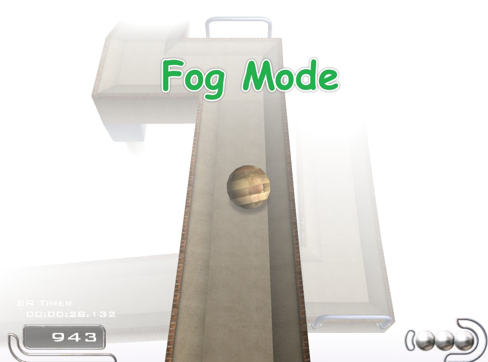
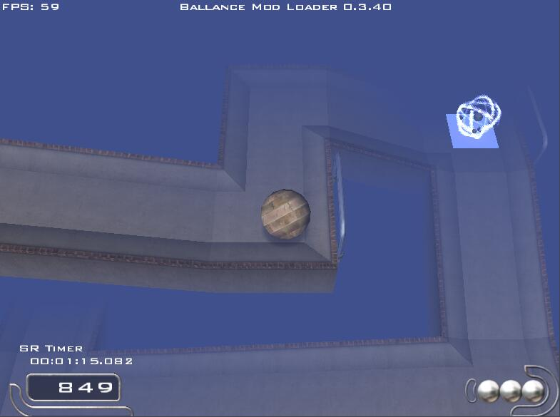

# Fog Mode for Ballance

这是一个用于 [Ballance](https://ballance.jxpxxzj.cn) 的 Mod，能够给 Ballance 添加线性雾效，增大难度，提供全新的游戏体验，~~丰富游戏性和趣味性~~

## 依赖

-   [BallanceModLoader](https://github.com/Gamepiaynmo/BallanceModLoader/releases)

## 功能

首次使用需要在设置中开启雾效

### Start

表示距离玩家摄像机 "Start" 距离开始渲染雾效

### End

雾的浓度会由距离 Start 线性增加至距离 End，此时浓度达到最大

这意味着距离摄像机大于 End 的物体将不可见

### Color

设置雾的颜色

-   支持使用 RGB 颜色值，如：`255,255,255` 或 `0,0,0`
-   支持使用 HEX 颜色值，如：`#808080`

此外，mod 里内置了一些颜色值，可直接输入**小写英文字母**使用：

-   black
-   gray
-   green
-   orange
-   pink
-   silver
-   aqua
-   cyan
-   purple
-   iris
-   red
-   white
-   yellow

**注意：彩色雾会让透明贴图渲染出错，暂时无法解决**

